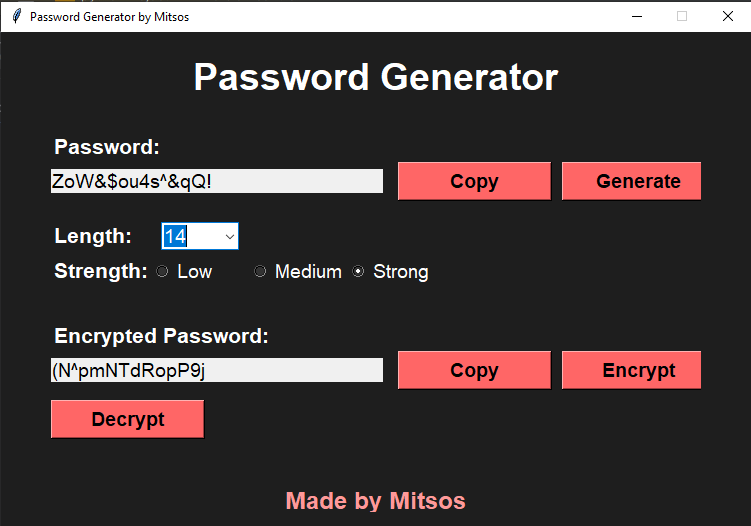

# Password Generator by Mitsos

A simple GUI password generator built with Python and Tkinter. Generate passwords of different lengths and strengths, copy them to the clipboard, and apply a very simple reversible encryption/decryption provided by the app.

---

## Features

- Generate passwords with selectable length (6–20) and strength (Low / Medium / Strong)
- One-click copy of generated or encrypted password to clipboard
- Simple encrypt and decrypt buttons (Caesar-style shift using a date-based key)
- Clean dark-themed Tkinter GUI with interactive buttons

---

## Screenshot




How to take and add a screenshot:
1. Run the app (see Usage below).
2. Take a screenshot of the application window (OS-specific tools: Snipping Tool on Windows, Screenshot on macOS, `gnome-screenshot` on many Linux desktops).
3. Create an `assets` folder in the repo root and save the image as `screenshot.png`.
4. Commit and push. The image will be displayed above.

---

## Requirements

- Python 3.8+ (should also work on 3.7)
- Tkinter (usually included with standard Python distributions)
  - On Linux you may need to install `python3-tk` (Debian/Ubuntu) or equivalent package for your distro.

---

## Installation

Clone the repository:

```bash
git clone https://github.com/Jimoulis31/PasswordGeneratorPython.git
cd PasswordGeneratorPython
```


---

## Usage

Run the application script in your environment. Replace `password_generator.py` with your script filename if it's different:

```bash
python password_generator.py
# or
python3 password_generator.py
```

The GUI will open. Use the controls to set length and strength, then click "Generate". Use "Copy" to copy the displayed password. To encrypt the generated password, click "Encrypt". To revert the encryption, click "Decrypt".

---

## GUI Overview

- Password: Read-only field that shows the last generated password.
- Copy: Copies the corresponding field to the system clipboard.
- Generate: Creates a new password based on the selected length and strength.
- Length: Select the length of the password (6, 8, 10, 12, 14, 16, 18, 20).
- Strength:
  - Low — lower-case letters only
  - Medium — uppercase + lowercase
  - Strong — uppercase + lowercase + digits + special characters
- Encrypted Password: Shows result of encryption. Use Encrypt and Decrypt buttons.

---

## How Encryption Works (Important)

The app's encryption is a simple substitution cipher (similar to a Caesar shift) that uses a key computed as:

```
key = (current_day + current_month) * 3
```

Each character is shifted within a fixed `digits` character set used by the app. Because the key depends on the current date at runtime and the method is reversible, this is convenient for demonstration but NOT secure for protecting sensitive passwords.

Security warning:
- This encryption is NOT cryptographically secure. Please do NOT use it to store or transmit real account passwords or sensitive data.
- For real security use established cryptographic libraries (e.g., `cryptography` or password managers that use industry-standard encryption).

---

## Suggested Improvements

- Use a secure encryption method (e.g., AES with a passphrase-derived key) from a well-reviewed library.
- Allow user-supplied passphrase for encryption instead of a date-derived key.
- Add unit tests for generation and encryption logic.
- Add an "automatically copy on generate" option.
- Improve character set options (include/exclude ambiguous characters).
- Add platform-specific instructions for packaging into an executable (PyInstaller, etc.).

---

## Contributing

Contributions are welcome. Suggested steps:
1. Fork the repository.
2. Create a branch for your change.
3. Make changes and add tests where appropriate.
4. Open a pull request describing your changes.

---

## License

This project does not include a license file by default. If you want to apply an open-source license, consider adding an SPDX license file such as the MIT License:

```text
MIT License

Copyright (c) 2026 Jimoulis31

Permission is hereby granted, free of charge, to any person obtaining a copy
of this software and associated documentation files (the "Software"), to deal
in the Software without restriction, including without limitation the rights
to use, copy, modify, merge, publish, distribute, sublicense, and/or sell
copies of the Software, and to permit persons to whom the Software is
furnished to do so, subject to the following conditions:

The above copyright notice and this permission notice shall be included in all
copies or substantial portions of the Software.

THE SOFTWARE IS PROVIDED "AS IS", WITHOUT WARRANTY OF ANY KIND, EXPRESS OR
IMPLIED, INCLUDING BUT NOT LIMITED TO THE WARRANTIES OF MERCHANTABILITY,
FITNESS FOR A PARTICULAR PURPOSE AND NONINFRINGEMENT. IN NO EVENT SHALL THE
AUTHORS OR COPYRIGHT HOLDERS BE LIABLE FOR ANY CLAIM, DAMAGES OR OTHER
LIABILITY, WHETHER IN AN ACTION OF CONTRACT, TORT OR OTHERWISE, ARISING FROM,
OUT OF OR IN CONNECTION WITH THE SOFTWARE OR THE USE OR OTHER DEALINGS IN THE
SOFTWARE.
...
```


---
