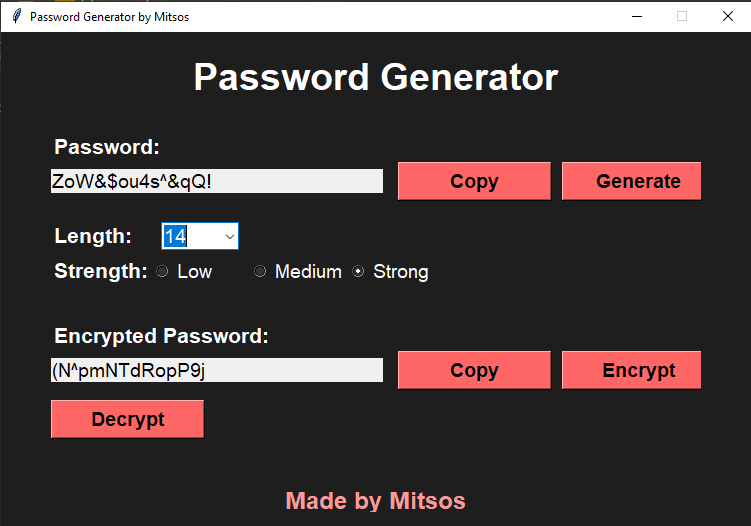

# Password Generator by Jimoulis31 🔐⚡

A simple **desktop password generator** built with Python and Tkinter.  
It allows you to generate secure passwords, copy them instantly, and apply a simple reversible encryption/decryption system.

---

## 📸 Screenshot

---

## 🛠 Features

- 🔐 Generate passwords with adjustable length (6–20)
- 🎚️ Strength options (Low / Medium / Strong)
- 📋 One-click copy to clipboard
- 🔄 Simple encrypt / decrypt system (Caesar-style shift)
- 🖥️ Clean dark-themed Tkinter GUI

---

## 🚀 How to Run

### 1. Clone the repository

git clone https://github.com/Jimoulis31/PasswordGeneratorPython.git
cd PasswordGeneratorPython

### 2. Run the app

python password_generator.py

---

## 📝 Usage

- Open the app
- Choose password length and strength
- Click **Generate**
- Use **Copy** to copy password
- Click **Encrypt** to encode the password
- Click **Decrypt** to restore it

---

## 🧠 How It Works

1. Password is generated using selected character rules
2. Strength defines character set complexity:
   - Low → lowercase only
   - Medium → lowercase + uppercase
   - Strong → letters + numbers + symbols
3. Encryption uses a simple **date-based Caesar shift**
4. Decryption reverses the shift using the same key logic

---

## ⚠️ Security Note

- This encryption is for **educational purposes only**
- It is NOT secure for real-world password storage
- For real security, use proper cryptographic libraries like `cryptography`

---

## 📦 File Structure

PasswordGeneratorPython/
├── password_generator.py
├── README.md
└── PasswordGenerator.png

---

## ⚡ Future Improvements

- Add secure AES encryption option
- Add auto-copy on generation
- Improve password rules (exclude similar characters option)
- Export passwords to encrypted file
- Package as .exe app (PyInstaller)

---

## 💻 Technologies

- Python 3.x
- Tkinter
- pyperclip (clipboard handling)

---

## 📧 Contact

Created by **Jimoulis31**
